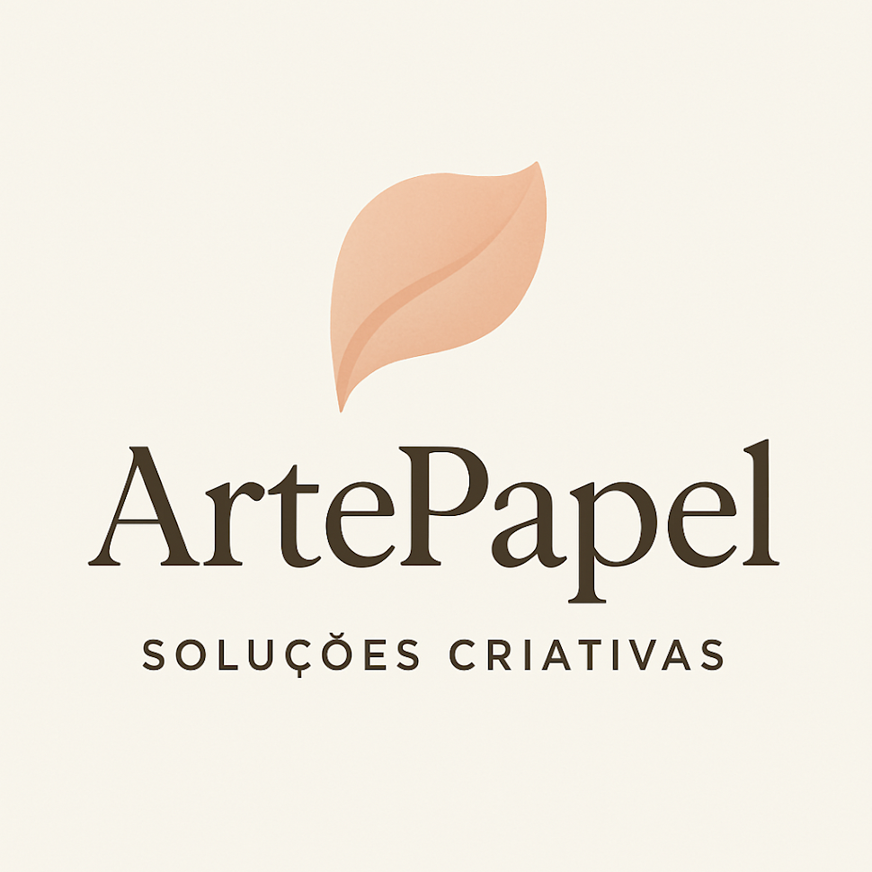

# ArtePapel Soluções Criativas 🎨



Website institucional da ArtePapel, uma empresa especializada em papelaria personalizada, embalagens criativas e impressos gráficos de alta qualidade.

## 🚀 Tecnologias Utilizadas

- HTML5
- TailwindCSS
- JavaScript
- Font Awesome Icons
- Google Fonts (Roboto)

## 📋 Características

- Design responsivo (mobile-first)
- Otimizado para SEO
- Performance otimizada
- Acessibilidade implementada
- Integração com redes sociais
- Formulário de contato completo
- Seções interativas

## 📂 Estrutura do Projeto

```
.
├── index.html              # Página principal
├── css/
│   └── style.css          # Estilos customizados
├── images/                 # Imagens do projeto
│   ├── clientes/          # Fotos de clientes
│   ├── portfolio/         # Imagens do portfólio
│   └── products/          # Ícones de produtos
└── js/                    # Scripts JavaScript
```

## 🌟 Funcionalidades

- **Menu Responsivo**: Navegação adaptável para dispositivos móveis
- **Seções Informativas**: 
  - Hero Section
  - Quem Somos
  - Por que nos Escolher
  - Produtos
  - Inspirações
  - Depoimentos
  - Contato
- **Elementos Interativos**:
  - Botão de WhatsApp fixo
  - Banner promocional
  - Formulário de contato inteligente
  - Animações suaves
  - Links para redes sociais

## 🛠️ Instalação & Execução

1. Clone o repositório:
```bash
git clone https://github.com/seu-usuario/artepapel.git
```

2. Navegue até o diretório do projeto:
```bash
cd artepapel
```

3. Abra o arquivo `index.html` em seu navegador ou use um servidor local.

## 🎯 SEO e Performance

O site foi otimizado para mecanismos de busca com:
- Meta tags apropriadas
- Tags Open Graph para compartilhamento em redes sociais
- Texto alternativo em imagens
- Estrutura semântica HTML
- Performance otimizada de imagens

## 📱 Responsividade

O site é totalmente responsivo e testado nos seguintes dispositivos/navegadores:
- Google Chrome
- Firefox
- Safari
- Edge
- Dispositivos móveis (iOS/Android)
- Tablets

## 👥 Público-Alvo

- Noivos e organizadores de eventos
- Empresas que buscam identidade visual em papelaria
- Marcas que precisam de embalagens personalizadas
- Profissionais liberais em busca de material gráfico

## 📬 Contato

- WhatsApp: (11) 99999-9999
- Email: contato@artepapel.com.br
- Endereço: São Paulo, SP

## 📄 Licença

Este projeto está sob a licença MIT. Veja o arquivo [LICENSE](LICENSE) para mais detalhes.

---

Desenvolvido com ❤️ para ArtePapel Soluções Criativas © 2025
